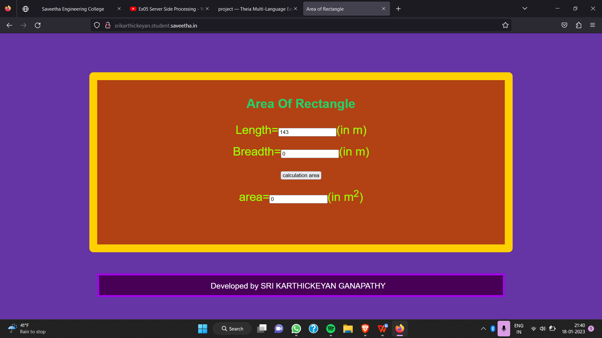

# Design a Website for Server Side Processing

## AIM:
To design a website to perform mathematical calculations in server side.

## DESIGN:

### STEP 1:
Clone the repository from GitHub

### STEP 2:
Create Django Admin project.

### STEP 3:
Create a New App.

### STEP 4:
Create python programs for views and urls.

### STEP 5:
Create a HTML file of forms.

### STEP 6:
Publish the website in the given URL.

## PROGRAM :
```
math.html

<!DOCTYPE html>
<html>
<head>
    <meta charset='utf-8'>
    <meta http-equiv='X-UA-Compatible' content='IE=edge'>
    <title>Area of Rectangle</title>
    <meta name='viewport' content='width=device-width, initial-scale=1'>
    <link rel='stylesheet' type='text/css' media='screen' href='main.css'>
    <script src='main.js'></script>
</head>
<style>
    *{
        box-sizing: border-box;
        font-family:Arial, Helvetica, sans-serif ;
    }
    body{
        background-color:rgb(101, 52, 165);
    }
    .container{
    width: 1080px;
    height: 460px;
    margin-top: 100px;
    margin-left: auto;
    margin-right: auto;
    border-radius: 10px;
    border: 20px solid rgb(255, 208, 0);
    background-color:rgb(178, 65, 20);
    }
    h1{
        text-align: center;
        padding-top: 20px;
        color: rgb(28, 210, 110);
    }
    .calculate{
        padding-top: 10px;
        padding-bottom: 10px;
        padding-left: 10px;
        padding-right:10px;
        text-align: center;
        color: rgb(153, 255, 0);
        font-size: 30px;
    }
    .footer {
  display: block;
  width: 100%;
  height: 60px;
  background-color: rgb(72,0,87);
  text-align: center;
  padding-top: 15px;
  padding-right: 15px;
  margin-right: 15px;
  margin-bottom: 20px;
  border: 5px solid rgb(163, 3, 236);
  color: white;
  font-size: 20px;
  margin-top: 150px;
}
</style>
<body>
    <div class="container">
<h1>Area Of Rectangle</h1>   
<form method ="POST">
    
    <div class="calculate" colour="red"> 
Length=<input type="text" name="length" value="{{l}}">(in m)</input></br>
    </div>
    <div class="calculate"> 
Breadth=<input type="text" name="breadth" value="{{b}}">(in m)</input></br>
    </div>
    <div class="calculate"> 
<input type="submit" value="calculation area"></input></br>
    </div>
    <div class="calculate"> 
area=<input type="text" name="area" value="{{area}}">(in m<sup>2</sup>)</input></br>
    </div>
    <br>
    <div class="footer">
        Developed by SRI KARTHICKEYAN GANAPATHY
    </div>
</form>
</body>
</html>

views.py

from django.shortcuts import render
def rectarea(request):
    context={}
    context['area'] = "0"
    context['l'] = "0"
    context['b'] = "0"
    if request.method == 'POST':
        print("POST method is used")
        l = request.POST.get('length','0')
        b = request.POST.get('breadth','0')
        print('request=',request)
        print('Length=',l)
        print('Breadth=',b)
        area = int(l) * int(b)
        context['area'] = area
        context['l'] = l
        context['b'] = b
        print('Area=',area)
    return render(request,'myapp/math.html',context)

urls.py

from django.contrib import admin
from django.urls import path
from myapp import views
urlpatterns = [
    path('admin/',admin.site.urls),
    path('areaofrectangle/',views.rectarea,name="areaofrectangle"),
    path('',views.rectarea,name="areaofrectangle")
]
```

## OUTPUT:

### Home Page:

## Result:
The program for implementing server side processing is completed successful.
